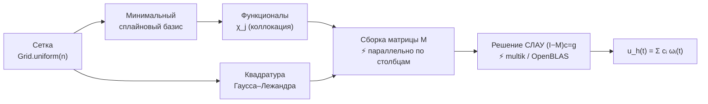
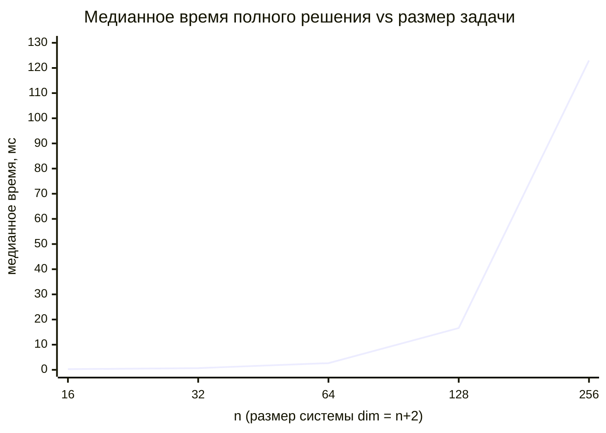
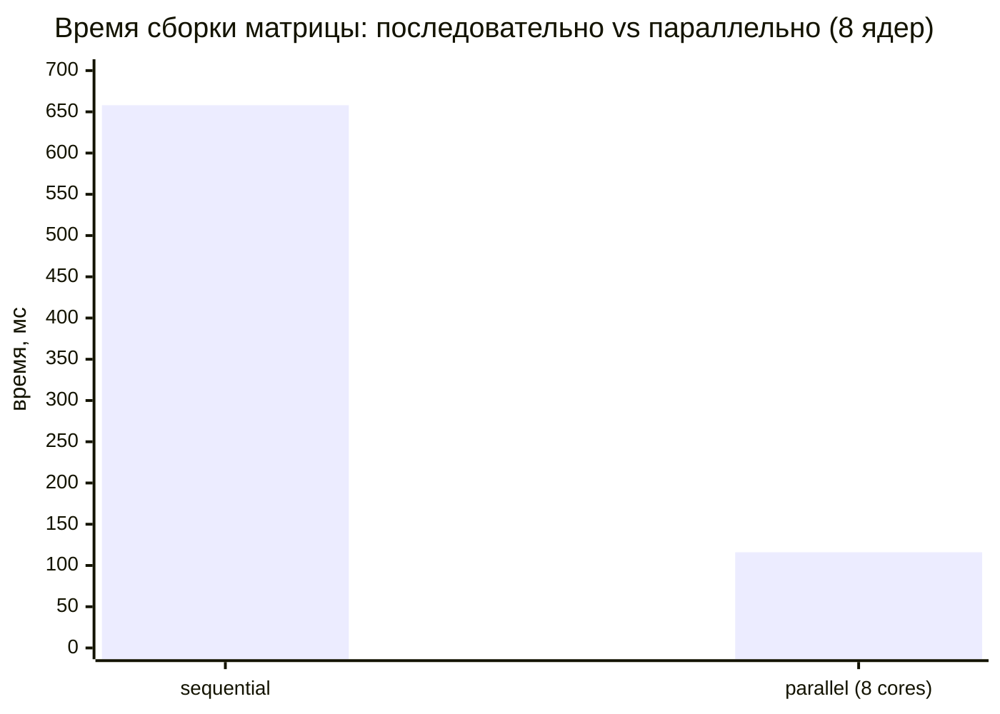

# Numerical-Algorithms

> Решение интегральных уравнений методом сплайн-коллокации на **минимальных сплайновых базисах** — с ориентацией на вычислительную эффективность и работу в высокопроизводительных вычислительных средах.

<p>
  
  
  
  
  
  
  
</p>

---

## 📖 О проекте

Библиотека численно решает три класса интегральных уравнений с помощью
**проекционно-коллокационных методов** на минимальных сплайнах:

| Класс | Уравнение | Особенность |
|-------|-----------|-------------|
| **Фредгольм** | $u(t) - \lambda\!\int_a^b K(t,s)\,u(s)\,ds = f(t)$ | линейное, фиксированные пределы |
| **Вольтерра** | $u(t) - \lambda\!\int_a^t K(t,s)\,u(s)\,ds = f(t)$ | линейное, переменный верхний предел |
| **Урысон**   | $u(t) - \int_a^b K\bigl(t,s,u(s)\bigr)\,ds = f(t)$ | нелинейное (Ньютон / Тихонов–Морозов) |

Для каждого класса поддерживаются уравнения **первого и второго рода**, несколько
коллокационных схем (базовая, Слоана, Кулкарни) и три порождающие системы
минимальных сплайнов — полиномиальная `B`, гиперболическая `H` и тригонометрическая `T`.

## 🧮 Математическая основа

Приближённое решение ищется в пространстве минимальных сплайнов как
$u_h(t) = \sum_i c_i\,\omega_i(t)$, где $\{\omega_i\}$ — координатные сплайны,
построенные по порождающей системе на сетке с узлами кратности 3.

Применение набора функционалов $\chi_j$ (коллокация / проектирование) к уравнению
сводит задачу к плотной системе линейных алгебраических уравнений

$$(I - M)\,c = g, \qquad M_{j,i} = \chi_j(\mathcal{L}\,\omega_i),\quad g_j = \chi_j(f),$$

где $\mathcal{L}$ — интегральный оператор, а интегралы вычисляются составной
квадратурой **Гаусса–Лежандра**. Для нелинейного уравнения Урысона система
решается итерациями Ньютона (с регуляризацией Тихонова и выбором параметра по
Морозову для некорректных задач первого рода).



## ⚡ Вычислительная эффективность и HPC

Реализация спроектирована под плотные задачи размера $N=n+2$ вплоть до $\sim 10^4$,
где узкими местами являются сборка матрицы и плотная линейная алгебра $O(N^3)$.
Ускорение организовано на **двух комплементарных уровнях**:

1. **Линейная алгебра → нативный BLAS.** `numerics.LinearAlgebra` сохраняет
   простой массивный API, но тяжёлые операции (`matMat`, `matVec`, `atWa`,
   `addScaled`, `solve`) делегируются библиотеке [**multik**](https://github.com/Kotlin/multik)
   с движком **OpenBLAS**. Решение СЛАУ выполняется нативным LAPACK с внутренней
   многопоточностью. Рукописная реализация сохранена как
   `numerics.ReferenceLinearAlgebra` — эталон корректности, с которым результаты
   сверяются в тестах.

2. **Сборка матриц → многоядерный параллелизм.** `numerics.ParallelAssembly`
   распределяет независимые строки/столбцы по ядрам через
   `java.util.stream.IntStream.parallel()` (общий ForkJoinPool, без сторонних
   зависимостей). Каждая задача пишет в свою строку → отсутствие гонок.
   Гонко-опасные участки (симметричная матрица Грама, scatter-add, конечно-разностный
   якобиан) осознанно оставлены последовательными.

> **Подключаемый бэкенд (SPI).** Тяжёлые операции вынесены за интерфейс
> `LinAlgBackend`; активный бэкенд выбирается в `Backends` с автоматическим
> откатом на чистый JVM. Новый бэкенд (GPU/распределённый BLAS) добавляется
> реализацией интерфейса + регистрацией — код решателей и фасад не меняются.

Подробности — в [`docs/HPC.md`](docs/HPC.md).

## 📊 Производительность

Измерено на Apple Silicon (arm64), 8 ядер, JDK 21, `./gradlew runBenchmark`.

### Масштабирование: полное решение Фредгольма (сборка + плотный solve)



| n | dim | медиана, мс | мин, мс |
|---|-----|-------------|---------|
| 16 | 18 | 0.27 | 0.19 |
| 32 | 34 | 0.68 | 0.59 |
| 64 | 66 | 2.66 | 2.44 |
| 128 | 130 | 16.6 | 15.9 |
| 256 | 258 | 123 | 119 |

### Ускорение параллельной сборки матрицы (matrixM, n = 256)



**Ускорение ≈ 5.65×** на 8 ядрах. Отклонение от идеального 8× ожидаемо:
мелкозернистые задачи, стоимость квадратуры на ячейку и пропускная способность
памяти. Плотный $O(N^3)$ solve дополнительно использует внутренние потоки OpenBLAS.

## 🗂️ Структура проекта

```
src/main/kotlin/
├── numerics/                  # общее вычислительное ядро
│   ├── LinearAlgebra.kt        #   API линалгебры → multik/OpenBLAS
│   ├── ReferenceLinearAlgebra.kt #  эталонная рукописная реализация
│   ├── ParallelAssembly.kt     #   многоядерная сборка матриц
│   ├── Quadrature.kt           #   Гаусс–Лежандр
│   ├── MinimalSplineBasis.kt   #   минимальные сплайны
│   ├── GeneratingSystem.kt     #   порождающие системы B / H / T
│   ├── Grid.kt, Fmt.kt, CheckResult.kt
│   └── functionals/            #   функционалы коллокации + метрики
├── solvers/
│   ├── fredholm/               # FredholmSolver
│   ├── volterra/               # VolterraSolver
│   └── uryson/                 # UrysonSolver (Ньютон / Тихонов–Морозов)
└── bench/Benchmark.kt          # бенчмарк-харнес (time vs N, speedup)

src/test/kotlin/                # 124 теста; ядро ~100% строк,
                                # решатели ~99% (характеризационные golden-тесты)
```

## 🚀 Быстрый старт

Требуется JDK 21 (Gradle wrapper подтянет всё остальное).

```bash
# сборка
./gradlew build

# тесты
./gradlew test

# отчёт о покрытии (Kover)
./gradlew koverHtmlReport      # build/reports/kover/html/index.html

# запуск решателей (печатают таблицы сходимости)
./gradlew runFredholm
./gradlew runVolterra
./gradlew runUryson

# бенчмарк производительности
./gradlew runBenchmark
```

## 💻 Пример использования

Решение уравнения Фредгольма второго рода на полиномиальном базисе и оценка
ошибки $E_h$ на сетке:

```kotlin
import numerics.Grid
import numerics.GeneratingSystem
import numerics.GaussLegendre
import numerics.MinimalSplineBasis
import numerics.functionals.ProjFunctionals
import numerics.functionals.errorEh
import solvers.fredholm.FredholmOperator
import solvers.fredholm.SecondKindSolver
import solvers.fredholm.ModelProblem

fun main() {
    val n = 64
    val grid  = Grid.uniform(n)
    val basis = MinimalSplineBasis(GeneratingSystem.B, grid)   // базис B / H / T
    val funcs = ProjFunctionals(basis)                          // функционалы коллокации
    val op    = FredholmOperator(ModelProblem.F2.kernel, grid, GaussLegendre(8))

    val solver = SecondKindSolver(
        basis, funcs, op, /* λ = */ 1.0,
        { t -> ModelProblem.F2.rhsExact(t, op) },
        { t -> ModelProblem.F2.rhsExactDeriv(t, op) },
    )

    val approx = solver.base()        // u_h: сборка матрицы (параллельно) + solve (OpenBLAS)
    val eh = errorEh({ t -> ModelProblem.F2.exact(t) }, approx.eval, grid)
    println("E_h(n=$n) = $eh")
}
```

## ✅ Тестирование и качество

- **124 теста**, все зелёные (`./gradlew test`).
- Ядро `numerics` и `numerics.functionals` — **100 % строк**.
- Три решателя — **~99 % строк** через характеризационные (golden) тесты,
  фиксирующие текущее поведение как сеть безопасности от регрессий.
- Покрытие измеряется **Kover**; форматирование/печать таблиц вынесены из метрики.
- Каждый тест снабжён KDoc, описывающим сценарий и происхождение эталона.

## 🗺️ Дорожная карта

- [ ] GPU-бэкенд (JCublas/cuSOLVER на NVIDIA или Metal на Apple Silicon) — требует соответствующего железа; SPI `LinAlgBackend` уже готов к его подключению.
- [ ] Полный перевод решателей на типы `NDArray` (сейчас — стабильный массивный API).
- [ ] Разрежённые/структурированные представления для $N > 10^4$.

## 🤝 Вклад

Pull request'ы приветствуются. Перед отправкой:

```bash
./gradlew test            # должно быть BUILD SUCCESSFUL
./gradlew koverHtmlReport # не понижайте покрытие ядра
```

Новые тесты сопровождайте KDoc-описанием сценария; численные эталоны либо
выводите аналитически, либо явно помечайте как зафиксированные с текущей реализации.

## 📄 Лицензия

Проект распространяется на условиях лицензии **Apache License 2.0** —
см. файл [`LICENSE`](LICENSE).

```
Copyright 2026 Egor Kulikov

Licensed under the Apache License, Version 2.0 (the "License");
you may not use this file except in compliance with the License.
You may obtain a copy of the License at

    http://www.apache.org/licenses/LICENSE-2.0
```
